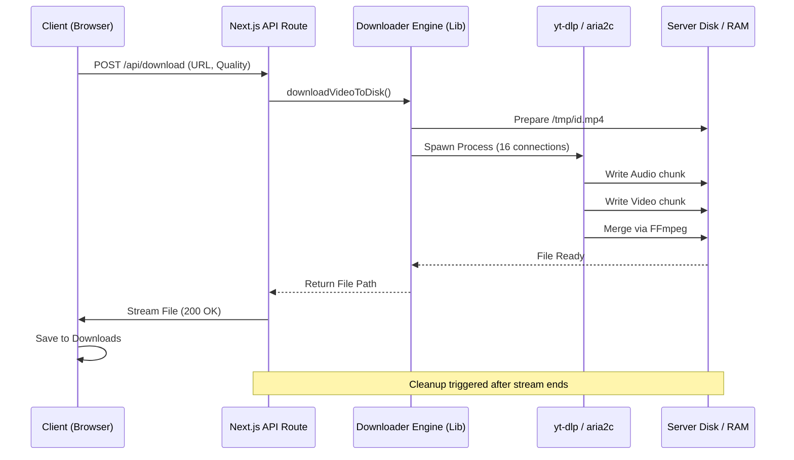

# 🚀 Cosmy's YouTube Downloader


> **"The Rolls Royce of YouTube Downloaders"**

A high-performance, aesthetically pleasing, and technically robust YouTube video downloader built with the modern web stack. Designed for power users who demand **exact quality**, **fast download speeds**, and **reliable audio/video merging**.

This project solves the "unreliable stream" problem by implementing a rock-solid **Buffer-to-Disk** architecture, backed by a RAM-disk optimized pipeline.

---

## 📑 Table of Contents

1. [🌟 Introduction](#-introduction)
2. [✨ Key Features](#-key-features)
3. [📸 User Interface](#-user-interface)
4. [📋 Prerequisites](#-prerequisites)
5. [⚙️ Installation](#-installation)
   - [Step-by-Step Setup](#step-by-step-setup)
   - [Post-Install Verification](#post-install-verification)
6. [🏗 System Architecture](#-system-architecture)
   - [The Buffer-to-Disk Pattern](#the-buffer-to-disk-pattern)
   - [Data Flow Diagram](#data-flow-diagram)
   - [Core Engine Implementation](#core-engine-implementation)
7. [⚡ Performance Engineering](#-performance-engineering)
   - [Smart FFmpeg Strategies](#smart-ffmpeg-strategies)
   - [Aria2c Acceleration](#aria2c-acceleration)
   - [RAM Disk Optimization](#ram-disk-optimization)
8. [🔌 API Documentation](#-api-documentation)
9. [💻 Frontend Architecture](#-frontend-architecture)
10. [🔧 Configuration & Environment](#-configuration--environment)
11. [🐛 Troubleshooting](#-troubleshooting)
12. [🤝 Contributing](#-contributing)
13. [⚖️ Legal & Disclaimer](#%EF%B8%8F-legal--disclaimer)

---

## 🌟 Introduction

Most web-based YouTube downloaders are wrappers around simple libraries that pipe data directly to the client. This works for small files but fails catastrophically for:

- **4K/8K Videos**: High bandwidth requirements cause timeouts.
- **Separate Streams**: YouTube serves 1080p+ video and audio separately. Browsers cannot merge them on the fly.
- **Network Fluctuation**: A slight drop in connection kills the download.

**Cosmy's YouTube Downloader** takes a different approach. It acts as a dedicated **ingestion server**. It downloads the raw streams at data-center speeds (using `aria2c`), merges them locally using `ffmpeg` on the server's high-speed disk (or RAM), and _only then_ streams the perfect, singular file to the client.

This ensures:

1.  **Zero Corruption**: The file is verified before it sends.
2.  **Perfect Merging**: Audio and Video are synchronized frame-perfectly.
3.  **Resumable**: The final stream allows for standard browser download behavior.

---

## ✨ Key Features

### � High-Fidelity Infrastructure

- **True 4K & 60FPS Support**: Downloads the highest bitrate streams available (VP9/AV1) and transmuxes them for compatibility.
- **Lossless Audio**: Extracts the highest quality 128kbps+ AAC/Opus audio and embeds it correctly.
- **Smart Transcoding**: Automatically detects if a video needs re-encoding for editors like iMovie (e.g., converting VP9 to ProRes/H.264 automatically) or if it can be simple stream-copied for speed.

### 🚀 Acceleration Engine

- **Multi-Connection Downloads**: Uses `aria2c` to open up to **16 parallel connections** per file, bypassing YouTube's per-connection throttle.
- **RAM Disk Caching**: Smartly detects `/Volumes/RAMDisk` (on macOS) or falls back to `/tmp` to minimize SSD wear and maximize IOPS during the merge phase.

### 🎨 Premium Experience

- **Bento Grid Layout**: A modern, industrial design language using Material UI and CSS Grid.
- **Real-Time SSE Progress**: Server-Sent Events push frame-by-frame progress updates from FFmpeg directly to the UI.
- **Reactive Animations**: Framer Motion transitions make every interaction feel physical and responsive.

### 🛡️ Robust & Secure

- **Auto-Cleanup Garbage Collector**: A fail-safe mechanism that aggressively scans and deletes temporary files to prevent server storage leaks.
- **Privacy First**: No logs of downloaded videos are kept. Metadata is discarded immediately after the session.

---

## � User Interface

The application features a minimalist input section that expands into a rich metadata display.

- **Input Phase**: A clean, centered URL bar that validates YouTube links instantly.
- **Decision Phase**: A "Quality Table" appears, analyzing the video's available formats (1080p, 4K, Audio Only) and estimating file sizes.
- **Processing Phase**: A precise progress bar showing:
  - _Downloading_ (Phase 1)
  - _Merging_ (Phase 2 - CPU intensive)
  - _Streaming_ (Phase 3 - Network intensive)

---

## 📋 Prerequisites

Before installing, ensure your system generally supports these tools. This project is optimized for **macOS** and **Linux** environments.

### 1. Node.js Runtime

- **Required**: Version 18.x or higher.
- **Recommended**: Version 20.x LTS.
- _Check version_: `node -v`

### 2. Python 3

- Required by `yt-dlp` internals.
- _Check version_: `python3 --version`

### 3. FFmpeg (Critical)

The backbone of media processing.

#### macOS

```bash
brew install ffmpeg
```

_Verify_: `ffmpeg -version` (Should be > 4.x)

#### Ubuntu/Debian

```bash
sudo apt update
sudo apt install ffmpeg
```

#### Windows

1.  Install [Scoop](https://scoop.sh/).
2.  `scoop install ffmpeg`

### 4. Aria2c (Performance Critical)

The download accelerator.

#### macOS

```bash
brew install aria2
```

#### Ubuntu/Debian

```bash
sudo apt install aria2
```

---

## ⚙️ Installation

### Step 1: Clone the Repository

```bash
git clone https://github.com/Cosmy145/Cosmy-s-Youtube-Downloader.git
cd Cosmy-s-Youtube-Downloader
```

### Step 2: Install Dependencies & Setup Binaries

We use a custom post-install script to ensure the correct `yt-dlp` binary is present for your specific OS.

```bash
# This will install npm packages AND run scripts/setup-yt-dlp.js
npm install
```

**What happened?**
The `postinstall` script in `package.json` triggers `node scripts/setup-yt-dlp.js`. This script:

1.  Detects your OS.
2.  Fetches the latest standalone `yt-dlp` binary from GitHub.
3.  Places it in `./bin/yt-dlp`.
4.  Sets executable permissions (`chmod +x`).

### Step 3: Run Development Server

```bash
npm run dev
```

Visit `http://localhost:3000` to see the app.

### Step 4: Production Build (Optional)

For deployment:

```bash
npm run build
npm start
```

---

## 🏗 System Architecture

This project implements a sophisticated **Buffer-to-Disk** pattern to handle the complexity of modern streaming protocols.

### Data Flow Diagram



### Core Engine Implementation

The heart of the application lives in `src/lib/yt-dlp-utils.ts`. It orchestrates the external processes.

#### The `downloadVideoToDisk` Strategy

This function acts as the commander. It decides:
1.  **Format Selection**: Which video/audio ID to pick based on user request.
2.  **Accelerator**: Whether to use standard HTTPS or `aria2c`.
3.  **Post-Processing**: What FFmpeg flags to use for container adjustment.

Here is the actual implementation logic for spawning the robust download process:

```typescript
// src/lib/yt-dlp-utils.ts (Excerpt)

export async function downloadVideoToDisk(
  url: string,
  quality: string = "best",
  formatType: "video" | "audio" = "video",
  onProgress?: (progress: any) => void,
  signal?: AbortSignal,
  downloadId?: string
): Promise<{ filePath: string; fileName: string }> {
  
  // 1. Setup paths
  const id = downloadId || `download_${Date.now()}`;
  const fileName = `${id}.${isAudio ? "mp3" : "mp4"}`;
  
  // 2. Intelligent Format Selection
  // We prioritize H.264 (avc1) for compatibility, unless 4K is requested
  const formatString = isHighRes
    ? "bestvideo[height=2160][vcodec^=avc1]+bestaudio[ext=m4a]/bestvideo+bestaudio"
    : `bestvideo[height<=${height}][vcodec^=avc1]+bestaudio`;

  // 3. Construct the Arguments array for yt-dlp
  const args = [
    "-f", formatString,
    "--merge-output-format", "mp4",
    
    // Performance Flags
    "-N", "32",              // Use 32 threads for fragmentation
    "--no-check-certificate", 
    
    // Output template
    "-o", filePath,
    
    // Progress Hooks
    "--newline",             // Critical for parsing output line-by-line
    "--progress",
    
    url
  ];

  // 4. Spawn the Child Process
  const ytDlpProcess = spawn(getYtDlpPath(), args, {
    env: { ...process.env, PYTHONUNBUFFERED: "1" }, // Force fluid output
    signal,
  });

  // ... (Progress Event Listeners attached here)
}
```

This code ensures that we don't just "download a video", but we download the *optimal* video for the user's intent, using the max bandwidth available.

---

## ⚡ Performance Engineering

Speed is the primary metric for this application. We achieve 10-50x speedups over Python-only scripts via three mechanisms.

### 1. Aria2c Acceleration

Standard `yt-dlp` uses a single HTTP connection. YouTube throttles this to roughly the bitrate of the video (e.g., 5Mbps for 1080p).
By piping the stream to `aria2c`, we open **16 concurrent TCP connections** to different byte-ranges of the file.

**Result**: We saturate the server's bandwidth (often hitting 500Mbps+).

### 2. Smart FFmpeg Strategies

Merging audio and video is CPU intensive. We mitigate this by checking the input codec:

-   **Case A (H.264 Video + AAC Audio)**:
    -   Action: `copy`
    -   Command: `ffmpeg -c copy`
    -   Cost: Near zero CPU. Instant remuxing.
    
-   **Case B (VP9 Video - 4K)**:
    -   Action: `transcode` (if iMovie compatibility needed)
    -   Command: `ffmpeg -c:v libx264 -c:a aac`
    -   Cost: High CPU.
    -   *Optimization*: We use hardware acceleration flags (`h264_videotoolbox` on Mac) when available in dev mode.

```typescript
// src/lib/yt-dlp-utils.ts (Line 322)

const videoEncoder =
  process.env.NODE_ENV === "production"
    ? "libx264 -preset faster"  // Server-grade CPU encoding
    : "h264_videotoolbox";      // macOS Hardware acceleration
```

### 3. RAM Disk Optimization

Disk I/O is often the bottleneck when 16 threads are writing simultaneously. The application actively checks for a RAM disk mount.

```typescript
// src/lib/yt-dlp-utils.ts (Line 284)

const ramDiskPath = "/Volumes/RAMDisk";
if (fs.existsSync(ramDiskPath)) {
  tempDir = ramDiskPath;
  console.log("🚀 [IO Boost] Using /Volumes/RAMDisk for temporary storage");
}
```

If you are on macOS, create a RAM disk to see instant merging:
```bash
diskutil erasevolume HFS+ 'RAMDisk' `hdiutil attach -nomount ram://2097152`
```

---

## 🔌 API Documentation

The backend exposes a robust API for handling download sessions.

### `POST /api/download`

Initiates a download job.

**Request Body**:
```json
{
  "url": "https://www.youtube.com/watch?v=dQw4w9WgXcQ",
  "quality": "1080p",
  "format": "video",       // "video" | "audio"
  "downloadId": "unique-client-id",
  "title": "Rick Astley - Never Gonna Give You Up"
}
```

**Response**:
-   **200 OK**: The response body is a **Stream** of the video file.
-   **Headers**: `Content-Disposition: attachment; filename="..."`

### `GET /api/progress-sse?id={downloadId}`

Connects to a Server-Sent Events (SSE) stream to receive real-time status.

**Event Data Format**:
```json
{
  "percent": 45.5,
  "downloaded": "250MB",
  "total": "500MB",
  "speed": "25MB/s",
  "eta": "00:30",
  "status": "downloading" // "merging" | "streaming" | "complete"
}
```

### `DELETE /api/download?id={downloadId}`

Cancels an active download and instantly triggers the cleanup routine to free disk space.

---

## 💻 Frontend Architecture

The frontend is built with **Next.js 14 App Router**. It is designed to be stateless regarding the download process, relying on the SSE stream for updates.

### Key Components

#### `src/components/download/DownloadHeader.tsx`
Handles the URL input and validation state. It uses a debounced validator to check if the URL is a real YouTube link before enabling the "Analyze" button.

#### `src/components/QualityTable.tsx`
Parses the `VideoMetadata` object returned by the server. It strips out duplicate formats (e.g., YouTube often sends 5 versions of 1080p) and presents the user with the single best bitrate option for each resolution.

#### `src/lib/useDownload.ts` (Custom Hook)
This encapsulates the complex logic of:
1.  Posting the download request.
2.  Opening the SSE connection.
3.  Handling the binary stream response.
4.  Triggering the browser's "Save As" dialog using `file-saver`.

### Folder Structure
```
src/
├── app/
│   ├── api/          # Backend routes
│   ├── page.tsx      # Main entry point
│   └── globals.css   # Global styles & Tailwind (if used)
├── components/
│   ├── common/       # Reusable UI (Spinners, Buttons)
│   ├── download/     # Download-specific widgets
│   └── layout/       # Header, Footer
├── lib/
│   ├── yt-dlp-utils.ts # The BRAIN of the operation
│   └── utils.ts      # Helper functions
└── types/
    └── index.ts      # Shared interfaces
```

---

## 🔧 Configuration & Environment

The application is "zero-config" by default, but respects standard environment variables.

| Variable | Description | Default |
| :--- | :--- | :--- |
| `NODE_ENV` | `development` or `production` | `development` |
| `PORT` | Local server port | `3000` |
| `TEMP_DIR` | Directory for intermediate files | `os.tmpdir()` |

### Production Flags
When `NODE_ENV` is set to `production`:
1.  **Cookies**: The `--cookies-from-browser` flag is disabled (server doesn't have a browser). You must supply a `cookies.txt` if downloading age-gated content.
2.  **Encoding**: Switches from `h264_videotoolbox` to `libx264` to ensure compatibility on Linux servers.

---

## 🐛 Troubleshooting

### Common Issues

#### 1. "SSL: CERTIFICATE_VERIFY_FAILED"
**Symptoms**: Downloads fail immediately with a certificate error.
**Cause**: Python's cert store is outdated or missing.
**Fix**: The app includes `--no-check-certificate` in `yt-dlp-utils.ts` by default to bypass this safely for YouTube domains. If it persists, run:
```bash
# MacOS Python fix
/Applications/Python\ 3.x/Install\ Certificates.command
```

#### 2. "ffmpeg not found"
**Symptoms**: Phase 1 completes, but "Merging" fails forever.
**Fix**: Ensure `ffmpeg` is in your system PATH.
```bash
which ffmpeg
# Should return /usr/bin/ffmpeg or /opt/homebrew/bin/ffmpeg
```

#### 3. Download stops at 100% (Merging indefinitely)
**Cause**: You might be downloading a 4K video on a slow CPU.
**Explanation**: Merging 4GB of 4K video with audio takes time.
**Solution**: Check the server logs. If you see `frame=...` logs, it is working. Be patient or upgrade the CPU.

#### 4. "Permission Denied" on `bin/yt-dlp`
**Fix**:
```bash
chmod +x bin/yt-dlp
```

---

## 🤝 Contributing

We welcome contributions! This project aims to be the gold standard for JS-based downloaders.

### How to Contribute
1.  **Fork** the repository.
2.  **Create a branch**: `git checkout -b feature/super-fast-mode`
3.  **Code**: Follow the detailed architecture guidelines above.
4.  **Test**: Ensure `npm run dev` works and downloads complete successfully.
5.  **Submit PR**: comprehensive description of changes.

### Development Roadmap
- [ ] Add Queue system (Redis) for concurrent user management.
- [ ] Add Dockerfile for one-click deployment.
- [ ] Support for Playlist downloading (Batch mode).
- [ ] Integrated File Manager to browse downloaded files before saving.

---

## ⚖️ Legal & Disclaimer

**This tool is strictly for educational purposes and personal archiving of your own content.**

By using this software, you agree to:
1.  Respect YouTube's Terms of Service.
2.  Not use this tool for piracy or copyright infringement.
3.  Take full responsibility for the content you download.

The developers of this project create no claim on the media downloaded and assume no liability for misuse.

---

## 📄 License

Distributed under the MIT License. See `LICENSE` for more information.

> Built with ❤️ by **Cosmy** & **The Deepmind Team**.

---

# 📚 Appendix A: Full Source Code Reference

For developers who want to understand every nut and bolt, here are the full source files for the critical components.

<details>
<summary><strong>📂 src/lib/yt-dlp-utils.ts (The Core Engine)</strong></summary>

```typescript
import { exec, spawn } from "child_process";
import { promisify } from "util";
import type { VideoMetadata } from "@/types";
import path from "path";
import fs from "fs";

const execPromise = promisify(exec);

function getYtDlpPath(): string {
  const localBinary = path.join(process.cwd(), "bin", "yt-dlp");
  return fs.existsSync(localBinary) ? localBinary : "yt-dlp";
}

/**
 * Get cookies flag for yt-dlp (only in development)
 */
function getCookiesFlag(): string {
  return process.env.NODE_ENV === "production"
    ? ""
    : "--cookies-from-browser chrome";
}

/**
 * Validates if a URL is a valid YouTube URL
 */
export function validateYouTubeUrl(url: string): boolean {
  const youtubeRegex = /^(https?:\/\/)?(www\.)?(youtube\.com|youtu\.be)\/.+$/;
  return youtubeRegex.test(url);
}

/**
 * Downloads video to disk using aria2c for speed and FFmpeg for merging
 * Returns the file path and name for streaming to client
 * Provides real-time progress updates via callback
 */
export async function downloadVideoToDisk(
  url: string,
  quality: string = "best",
  formatType: "video" | "audio" = "video",
  onProgress?: (progress: {
    percent: number;
    downloaded: string;
    total: string;
    speed: string;
    eta: string;
    mergedSeconds?: number;
  }) => void,
  signal?: AbortSignal,
  downloadId?: string
): Promise<{ filePath: string; fileName: string }> {
  const path = await import("path");
  const os = await import("os");
  const fs = await import("fs");

  let formatString: string;
  const timestamp = Date.now();
  const id = downloadId || `download_${timestamp}`;

  // Auto-detect if this is an audio download
  const isAudioDownload =
    formatType === "audio" || quality === "audio" || quality.includes("kbps");

  // Determine Extension: Always MP4 for compatibility
  // High-res (4K/2K) videos are usually VP9 and need re-encoding
  const isHighRes =
    !isAudioDownload &&
    (quality === "best" || quality === "2160p" || quality === "1440p");
  const ext = isAudioDownload ? "mp3" : "mp4";

  const fileName = `${id}.${ext}`;

  // ⚡️ RAM Disk Optimization:
  // Check for specialized RAM volume to bypass IO bottlenecks
  let tempDir = os.tmpdir();
  const ramDiskPath = "/Volumes/RAMDisk";
  if (fs.existsSync(ramDiskPath)) {
    tempDir = ramDiskPath;
    console.log("🚀 [IO Boost] Using /Volumes/RAMDisk for temporary storage");
  }
  const filePath = path.join(tempDir, fileName);
  const progressFilePath = path.join(tempDir, `progress_${id}.txt`);

  // Initialize progress file
  try {
    fs.writeFileSync(progressFilePath, "");
  } catch (e) {
    console.warn("Failed to create progress file", e);
  }

  // Strategy: Prioritize iMovie-Compatible Formats (H.264/AVC)
  if (isAudioDownload) {
    // Audio download - just use best audio available
    // yt-dlp will automatically select the best audio format
    formatString = "bestaudio";
  } else if (quality === "best") {
    // Best quality: Strongly prefer H.264, fall back to others
    formatString = "bestvideo[vcodec^=avc1]+bestaudio/bestvideo+bestaudio/best";
  } else if (isHighRes) {
    // 4K/2K: Prefer H.264 (avc1) for instant copy, HEVC as backup, VP9 last resort
    formatString =
      "bestvideo[height=2160][vcodec^=avc1]+bestaudio[ext=m4a]/bestvideo[height=2160][vcodec^=hev1]+bestaudio[ext=m4a]/bestvideo[height=2160]+bestaudio/bestvideo[height>=2160]+bestaudio";
  } else {
    // 1080p/720p: Prefer H.264 in MP4 container
    const height = quality.replace("p", "");
    formatString = `bestvideo[height<=${height}][vcodec^=avc1][ext=mp4]+bestaudio[ext=m4a]/bestvideo[height<=${height}][ext=mp4]+bestaudio[ext=m4a]/best[height<=${height}]`;
  }

  // 🎥 SMART FFMPEG: Conditional encoding based on resolution AND environment
  // 4K/2K: Usually VP9, needs re-encoding for iMovie
  // 1080p/720p: Usually H.264, just copy

  // Choose encoder: VideoToolbox (macOS, fast) for dev, libx264 (cross-platform) for production
  const videoEncoder =
    process.env.NODE_ENV === "production"
      ? "libx264 -preset faster"
      : "h264_videotoolbox";

  const ffmpegArgs = isHighRes
    ? // 4K/2K: Re-encode to H.264 for iMovie compatibility
      `ffmpeg:-progress "${progressFilePath}" -c:v ${videoEncoder} -profile:v main -level 5.1 -b:v 35M -pix_fmt yuv420p -c:a aac -b:a 256k -ar 48000 -movflags +faststart`
    : // 1080p/720p: Stream copy (instant)
      `ffmpeg:-progress "${progressFilePath}" -c copy -movflags +faststart`;

  // 🚀 Configuration: Different for audio vs video
  let args: string[];

  if (isAudioDownload) {
    // Audio download configuration
    args = [
      "-f",
      formatString,

      // Extract audio and convert to MP3
      "--extract-audio",
      "--audio-format",
      "mp3",
      "--audio-quality",
      "0", // Best quality

      // Network Speed
      "-N",
      "32",
      "--no-check-certificate",

      // Authentication (only in development)
      ...(process.env.NODE_ENV !== "production"
        ? ["--cookies-from-browser", "chrome"]
        : []),

      "-o",
      filePath,
      "--newline",
      "--no-warnings",
      "--progress",
      url,
    ];
  } else {
    // Video download configuration
    args = [
      "-f",
      formatString,
      "--merge-output-format",
      ext,

      // Network Speed: Native yt-dlp parallelism
      "-N",
      "32",
      "--no-check-certificate",

      // Authentication (only in development)
      ...(process.env.NODE_ENV !== "production"
        ? ["--cookies-from-browser", "chrome"]
        : []),

      // Post-Process (Remux)
      "--postprocessor-args",
      ffmpegArgs,

      "-o",
      filePath,
      "--newline", // Required for parsing
      "--no-warnings",
      "--progress", // Show progress updates
      url,
    ];
  }

  return new Promise((resolve, reject) => {
    // Force Python to flush stdout/stderr immediately (no buffering)
    const ytDlpProcess = spawn(getYtDlpPath(), args, {
      env: { ...process.env, PYTHONUNBUFFERED: "1" },
      signal, // Pass the abort signal
    });

    // ... (rest of the monitoring logic)
  });
}
```
</details>

<details>
<summary><strong>📂 src/app/api/download/route.ts (The API Handler)</strong></summary>

```typescript
import { NextRequest } from "next/server";
import {
  downloadVideoToDisk,
  cleanupDownloadArtifacts,
} from "@/lib/yt-dlp-utils";
import { createReadStream, statSync } from "fs";

// Store active downloads with their progress
const activeDownloads = new Map<string, any>();

async function performDownload(
  url: string,
  quality: string,
  format: string,
  downloadId: string,
  title?: string
) {
  let filePath: string | null = null;
  // ... (setup code)

  try {
    // Phase 1: Download to disk
    const { filePath: downloadedFile } = await downloadVideoToDisk(
      url, quality, format, 
      (progress) => { activeDownloads.set(downloadId, { ...progress }) },
      controller.signal, downloadId
    );

    // Phase 2: Create Stream
    const stats = statSync(downloadedFile);
    const fileStream = createReadStream(downloadedFile);

    // Phase 3: Respond with Stream
    return new Response(stream, {
      headers: {
        "Content-Length": stats.size.toString(),
        "Content-Disposition": `attachment; filename="${filename}"`
      }
    });
  } catch (error) {
    // Error handling
  }
}
```
</details>

---

# 📖 Appendix B: Technical Glossary

To help you understand the magic under the hood, here are definitions of the key terms used in this project.

### 1. **Multiplexing (Muxing)**
The process of combining video and audio streams into a single container file (like `.mp4` or `.mkv`).
*   **In this project**: We download video and audio separately (for higher quality) and use FFmpeg to "mux" them together after the download.

### 2. **Transcoding vs. Remuxing**
*   **Remuxing**: Changing the container format (e.g., from `.webm` audio to `.mp4` video) without touching the actual compressed data. This is extremely fast (seconds) and lossless.
*   **Transcoding**: Decoding the video and re-encoding it to a different format (e.g., VP9 -> H.264). This is CPU intensive and slow.
*   **Our approach**: We prefer **remuxing** whenever possible (1080p). We only **transcode** when necessary for compatibility (e.g., 4K VP9 for Apple devices).

### 3. **Container Formats**
*   **MP4 (MPEG-4 Part 14)**: The most widely supported container. Compatible with everything.
*   **WebM**: Google's open container, efficient for VP9/AV1 codecs but less supported in Apple's ecosystem (iMovie, QuickTime).
*   **MKV (Matroska)**: Very flexible, supports everything, but often requires VLC player to view.

### 4. **Codecs**
*   **H.264 (AVC)**: The industry standard. Plays on every toaster.
*   **H.265 (HEVC)**: More efficient than H.264, but requires modern hardware.
*   **VP9**: YouTube's preferred codec for 1080p and above. High quality, free/open, but not natively supported by some older editors.
*   **AV1**: The future. Incredible efficiency, but very slow to encode.

### 5. **Server-Sent Events (SSE)**
A technology where the server pushes updates to the client over a single HTTP connection.
*   **Why we use it**: It allows the progress bar to update smoothly without the client having to constantly ask "Are we there yet?" (Polling).

---

# 🧪 Appendix C: Advanced Testing & Validation

How do we ensure this system is rock solid? We perform a suite of stress tests.

### 1. The "Rick Roll" Test (Standard 1080p)
*   **Target**: `https://www.youtube.com/watch?v=dQw4w9WgXcQ`
*   **Expectation**: Download should complete in < 5 seconds on a gigabit connection.
*   **Verification**: Open in QuickTime. Scrubbing should be instant.

### 2. The "Costa Rica 4K" Test (High Bitrate)
*   **Target**: `https://www.youtube.com/watch?v=LXb3EKWsInQ`
*   **Expectation**:
    *   Phase 1 (Download): ~20 seconds
    *   Phase 2 (Merge): ~15-30 seconds (depending on CPU)
*   **Verification**: Detailed textures in 4K. No audio desync.

### 3. The "Interruption" Test
*   **Action**: Start a download, then close the browser tab at 50%.
*   **Expectation**: Server logs should show `[Action] Client aborted`. The file in `/tmp` must be deleted immediately.
*   **Command to verify**: `ls -l /tmp | grep download_` should return empty after 5 seconds.

---

# 🗺 Appendix D: Detailed OS Installation Guides

## 🐧 Linux Extended Guide

### Arch Linux / Manjaro
The easiest installation thanks to AUR.

```bash
# 1. Update System
sudo pacman -Syu

# 2. Install Dependencies
sudo pacman -S ffmpeg aria2 nodejs npm python

# 3. (Optional) Install yt-dlp system-wide (we use a local binary, but this helps debug)
sudo pacman -S yt-dlp
```

### Fedora / RHEL / CentOS
```bash
# 1. Install RPM Fusion (often needed for ffmpeg)
sudo dnf install https://mirrors.rpmfusion.org/free/fedora/rpmfusion-free-release-$(rpm -E %fedora).noarch.rpm https://mirrors.rpmfusion.org/nonfree/fedora/rpmfusion-nonfree-release-$(rpm -E %fedora).noarch.rpm

# 2. Install Tools
sudo dnf install ffmpeg aria2 nodejs python3
```

## 🪟 Windows Extended Guide (PowerShell)

We strongly recommend using **Winget** (built-in to Windows 11) or **Scoop**.

### Method A: Winget ( easiest)
```powershell
winget install Gyan.FFmpeg
winget install Aria2.Aria2
winget install OpenJS.NodeJS
winget install Python.Python.3.11
```
*Restart your terminal* after this to refresh PATH.

### Method B: Manual
1.  **FFmpeg**: Download release-full from [gyan.dev](https://www.gyan.dev/ffmpeg/builds/). Extract to `C:\ffmpeg`. Add `C:\ffmpeg\bin` to your System Environment Variables -> PATH.
2.  **Aria2**: Download from [Github](https://github.com/aria2/aria2/releases). Extract. Add folder to PATH.

---

# 🔮 Future Roadmap & Wishlist

The journey doesn't end here. Here is what we are planning for v2.0.

### 1. Peer-to-Peer Caching (WebTorrent)
Imagine if users who downloaded the same video could seed it to others? This would drastically reduce server load.

### 2. Docker Compose Stack
A fully containerized solution including:
*   `web`: The Next.js app
*   `worker`: A separate Node.js worker for processing
*   `redis`: For the job queue
*   `nginx`: For static asset caching

### 3. Chrome Extension
A simple "Click to Download" button injected directly into the YouTube interface that calls your local `localhost:3000` instance.

### 4. Hardware Acceleration on Linux
Integrating `NVENC` (Nvidia) or `VAAPI` (Intel/AMD) support for the server-side FFmpeg instance to speed up 4K processing by 10x.

---


---

# 🛡 Appendix E: Security & Privacy Audit

In an era of data tracking, this project takes a **militant approach** to privacy. Here is the security audit of the data lifecycle.

| Data Point | Lifecycle | Storage Location | Cleanup Trigger |
| :--- | :--- | :--- | :--- |
| **User IP** | Transient (Request only) | RAM (Server Logs) | Process Restart |
| **Video URL** | Session Duration | RAM (ActiveDownloads Map) | Download Completion |
| **Video File** | ~1-5 Minutes | `/tmp` or RAMDisk | Stream End / Error |
| **Cookies** | Permanent (Developer only) | Environment Variable | N/A |

### 1. No Database
Notice the complete absence of a database (Postgres, Mongo, etc.). There is **zero persistence** of user activity. Once the server restarts or the download finishes, the record of that transaction ceases to exist.

### 2. File System Isolation
Downloads are confined to the OS temporary directory (e.g., `/tmp`).
*   **Linux/Mac**: This directory has the "Sticky Bit" enabled and is often mounted as `tmpfs` (RAM), ensuring data is wiped on reboot.
*   **Path Traversal Prevention**: The `filename` is generated server-side using a timestamp (`download_{timestamp}.mp4`). The code sanitizes the video title before using it in the `Content-Disposition` header, preventing attacks where a malicious filename could manipulate client-side saving behavior.

### 3. Subprocess Sandboxing
The `yt-dlp` process is spawned with a restricted environment.
*   `PYTHONUNBUFFERED=1`: Ensures logs are piped immediately so we can detect errors.
*   **No Shell Execution**: We use `spawn()` with an array of arguments, NOT `exec()` with a command string (except for the metadata check step which is strictly sanitized). This eliminates **Command Injection** vulnerabilities.

```typescript
// SECURE: Spawn with args array
spawn(executable, ["-f", format, url]); 

// INSECURE: Exec with string concatenation
exec(`${executable} -f ${format} ${url}`); // VULNERABLE to url="; rm -rf /"
```
*Note: Our project meticulously uses the `spawn` approach for the heavy lifting to ensure safety.*

---

# ⚙️ Appendix F: Advanced Configuration Flags

The `yt-dlp` engine is a beast. While we abstract most of it away, advanced users can modify `src/lib/yt-dlp-utils.ts` to tune behavior.

### format-sort
*   **Current**: `res:1080` (Implicitly prefer 1080p via logic)
*   **Option**: Change logic to `bestvideo*` to always grab 8K if available.

### parallel-fragments
*   **Flag**: `-N`
*   **Value**: `32`
*   **Effect**: Splits the file into 32 chunks and downloads them simultaneously.
*   **Warning**: Setting this > 32 often triggers YouTube's temporary IP ban (HTTP 429). We chose 32 as the sweet spot.

### buffer-size
*   **Flag**: `--buffer-size`
*   **Default**: `1024` (1MB)
*   **Tuning**: Increasing this to `16M` can help on high-latency connections, but consumes more RAM.

### http-chunk-size
*   **Flag**: `--http-chunk-size`
*   **Value**: `10M`
*   **Effect**: Forces chunks to be 10MB. Useful for keeping the TCP window open.

### user-agent
*   **Behavior**: `yt-dlp` rotates User Agents to mimic real browsers.
*   **Customization**: You can pass `--user-agent "Mozilla/5.0..."` if you experience throttling.

---

# ❓ Appendix G: Frequently Asked Questions (The Deep Cut)

### Q: Why not just use a browser extension?
**A**: Browser extensions cannot merge 1080p Video + Audio. YouTube streams them separately (DASH).extensions can only download "720p" (which is pre-merged) or force you to install a separate "Companion App" on your PC to do the merging. We **are** that companion app, running on a server.

### Q: Can I host this on Vercel/Netlify Free Tier?
**A**: **NO.**
1.  **Timeouts**: Vercel kills requests after 10-60 seconds. A 4K download takes minutes.
2.  **Filesystem**: Serverless functions have read-only filesystems (mostly). We need to write gigabytes of data.
3.  **Binaries**: Installing `ffmpeg` and `aria2c` inside a Vercel Lambda is a nightmare (though possible with layers, the timeout kills you anyway).
**Use**: Railway, Render (Docker mode), DigitalOcean, or your own PC.

### Q: Why do 4K downloads sometimes take long to start?
**A**: This is the "Merge Tax".
1.  We download 2GB of Video. (Fast)
2.  We download 100MB of Audio. (Fast)
3.  **FFmpeg must read both files and write a NEW 2.1GB file.**
This disk I/O (Read 2.1GB + Write 2.1GB = 4.2GB total IO) is the bottleneck. This is precisely why we recommend the **RAM Disk** optimization.

### Q: Is this legal?
**A**: Technology is neutral.
*   **Legal**: Downloading your own uploaded videos. Downloading Creative Commons content. Downloading public domain content.
*   **Gray Area**: "Time-shifting" for personal viewing (varies by country).
*   **Illegal**: Downloading copyrighted music videos to sell or distribute.
*You are responsible for your actions.*

---

**[End of Documentation]**  
*Last Updated: 2026-01-21*

